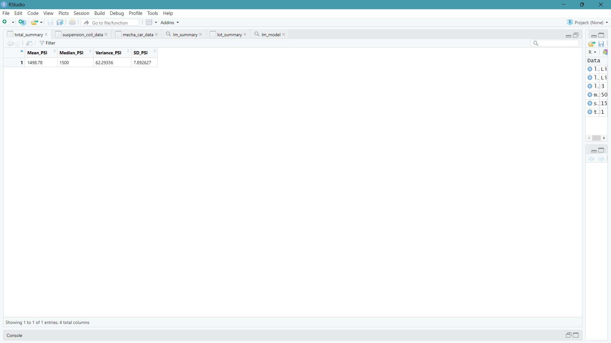
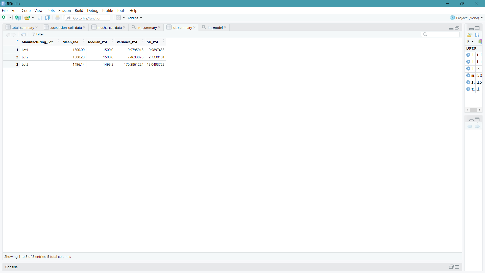
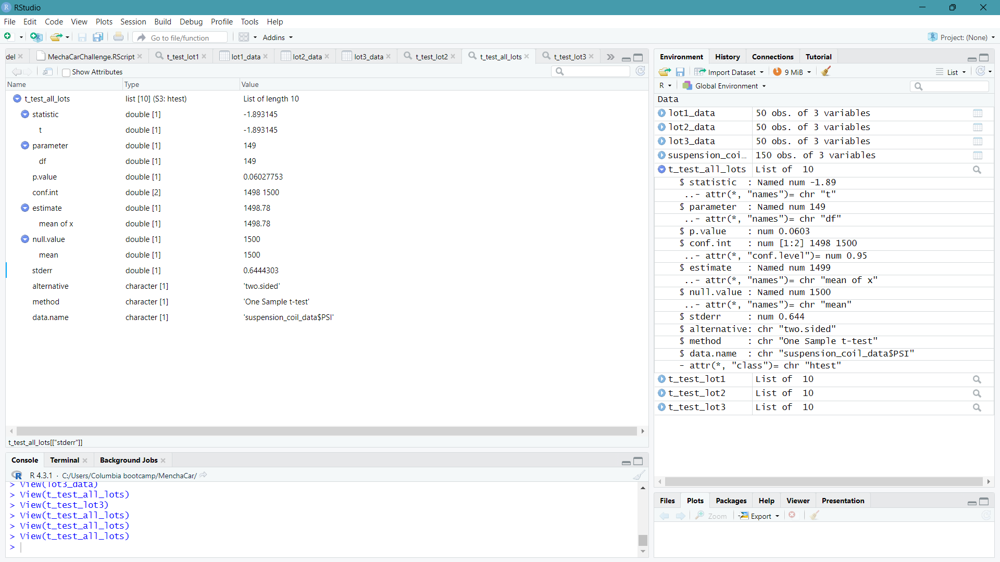
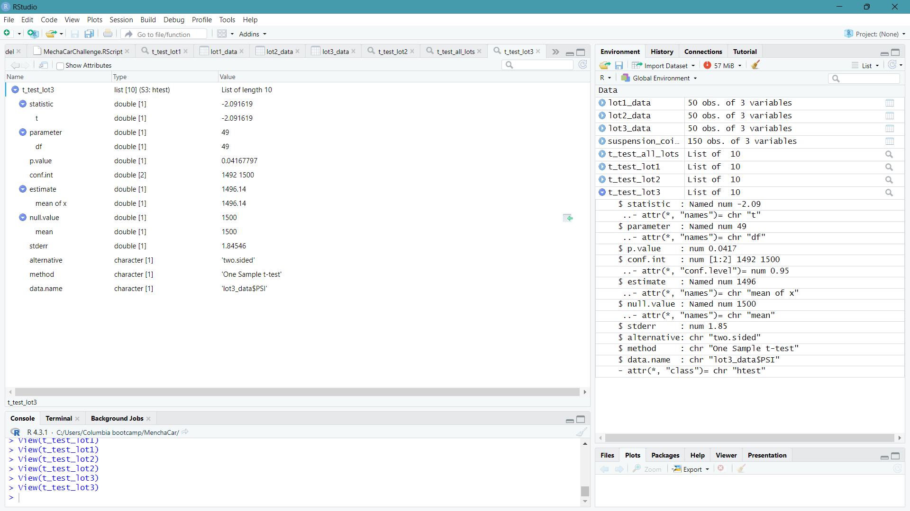

# MechaCar Statistical Analysis

Statistical analysis in R exploring vehicle MPG and suspension coil PSI. The saved analysis includes a multiple linear regression model, summary statistics, and one-sample t-tests.

[Console transcript](MechaCarChallenge.RScript) · [MPG data](MechaCar_mpg%5B1%5D.csv)
